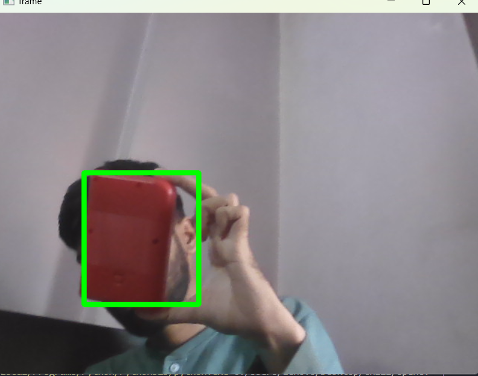

# COLOR DETECTION 
## 💡 Description

This project detects objects of a specified color in images or video streams using OpenCV. It identifies regions matching the target color, draws bounding boxes around them, and highlights their location. Such color-based object detection can be used in industrial automation for quality control, and in computer vision applications like gesture recognition or traffic signal detection.

## 🖼️ Demo

